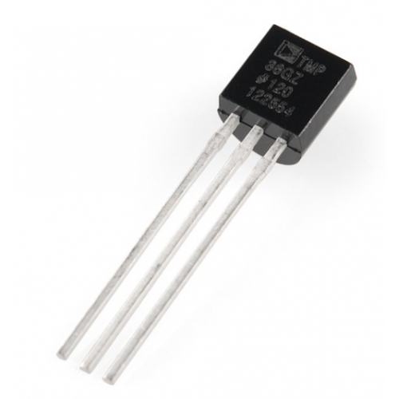
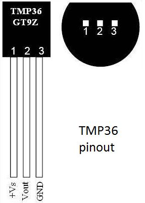

# TMP36 Temperature Sensor

Code for getting started with a TMP36 temperature sensor.

The TMP36 is a low voltage, precision centigrade temperature sensor. It provides an analogue voltage output that is linearly proportional to the Celsius temperature. It requires no external calibration and provides typical accuracies of ±1°C at +25°C and ±2°C over the −40°C to +125°C temperature range. The output voltage can be converted to temperature easily using the scale factor of 10 mV/°C.

Features:

- Voltage Input: 2.7 V to 5.5 VDC
- 10 mV/°C scale factor
- ±2°C accuracy over temperature
- ±0.5°C linearity
- Operating Range: −40°C to +125°C

 

## Boards

Setup instructions and starter code for different development boards

| Board | Folder |
| --- | --- |
| Arduino Uno | [arduino-uno/](arduino-uno/) |
| Arduino MKR WiFi 1010 | For MKR WiFi 1010 follow instructions for Arduino Uno [arduino-uno/](arduino-uno/) |
| Arduino Nano 33 BLE | For Nano 33 BLE follow instructions for Arduino Uno [arduino-uno/](arduino-uno/) |
| ESP32 | [esp32/](esp32/) |
| ESP8266 | [esp8266/](esp8266/) |
| Jetson Nano | For Jetson Nano, follow instructions for Raspberry Pi [raspberry-pi/](raspberry-pi/) |
| Raspberry Pi | [raspberry-pi/](raspberry-pi/) |
|  |  |

 

## Other Files and Folders

| File/Folder | Description |
|--- | --- |
| [docs/TMP35_36_37.pdf](docs/TMP35_36_37.pdf) | Data sheet for sensor |
|  |  |

 

## Branches

**main**: main branch. currently not using other branches.

 

## References

- Product page: https://www.analog.com/en/products/tmp36.html
- Datasheet: https://www.analog.com/media/en/technical-documentation/data-sheets/TMP35_36_37.pdf
