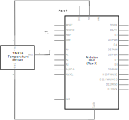
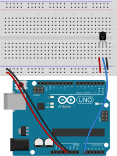

# Arduino Uno and TMP36 Temperature Sensor

Setup instructions and starter code for using the TMP36 temperature sensor and an Arduino development board.

 

## Files and Folders

| File/Folder | Description |
|--- | --- |
| [arduino/](arduino/) | Arduino projects folder |
| [arduino/tmp36-temperature-sensor/tmp36-temperature-sensor.ino](arduino/tmp36-temperature-sensor/tmp36-temperature-sensor.ino) | Simple arduino sketch. |
| [mkr-wifi-1010-setup.md](mkr-wifi-1010-setup.md) | Setup instructions for using an Arduino MKR WiFi 1010 dev board. |
|  |  |

 

## Setup

Setup instructions for an Arduino Uno board is below. For MKR WiFi 1010 based setup instructions see [mkr-wifi-1010-setup.md](mkr-wifi-1010-setup.md).

## Circuit Diagram
Wire the components as shown in the diagram.

#### Components Needed
* TMP36 temperature sensor
* connecting wires
* arduino uno development board

 

 

### Default Pin Wiring

| Pin No | Function | Device Connection |
| --- | --- | --- |
| 5V | +5V | Vdd |
| GND | GND | GND |
| A0 | Analogue Input | Vout |
|  |  |  |

 

## Arduino

The sketch will work with many different types and chipset of board. To use an Arduino Uno, make sure to select the correct board in Boards Manager.

The arduino sketch does not require any external libraries.

## References

* https://www.arduino.cc/en/reference/board
