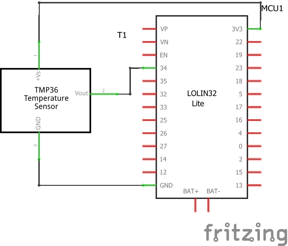
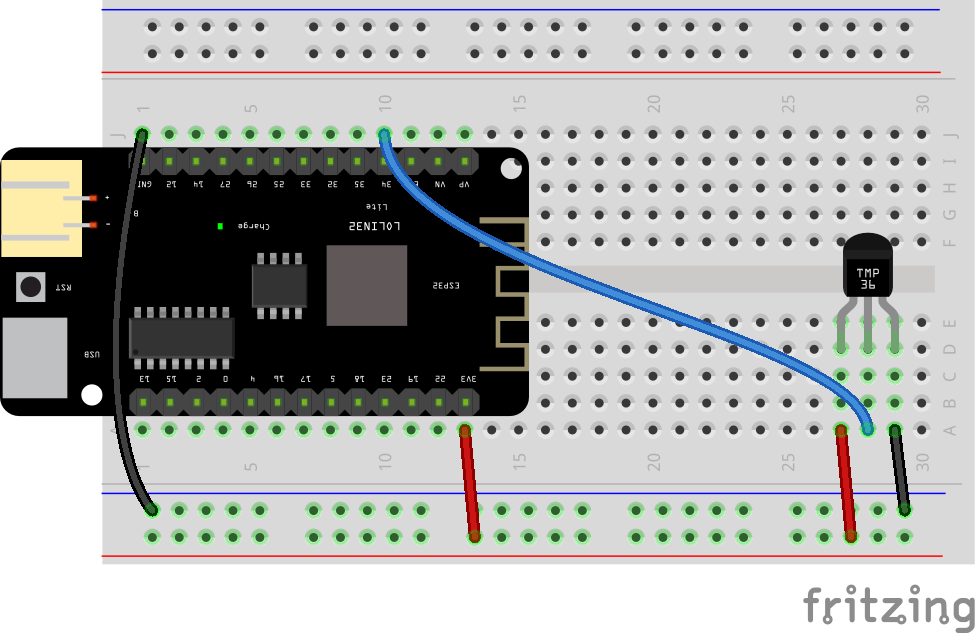

# ESP32 and TMP36 Temperature Sensor

Setup instructions for an ESP32 based development board, like the Lolin D32 or Lolin32 Lite.

 

## Files and Folders

| File/Folder | Description |
|--- | --- |
| arduino | For Arduino, use the sketches in the Arduino Uno folder [../arduino-uno/arduino](../arduino-uno/arduino) |
| [micropython/](micropython/) | folder for micropython scripts. Pymakr is configured to sync this folder with the micropython device. |
| [micropython/read_temperature.py](micropython/read_temperature.py) | MicroPython script that reads the temperature value from the sensor and prints it to the REPL. |
|  |  |

 

## Setup

Setup instructions for a Lolin32 Lite are below.

## Circuit Diagram
Wire the components as shown in the diagram.

#### Components Needed
* TMP36 temperature sensor
* connecting wires
* esp32 development board

 

 

### Default Pin Wiring

| Pin No | Function |  | Device Connection |
| --- | --- | --- | --- |
|  |  |  |  |
|  | +3.3V |  | Vdd |
|  | GND |  | GND |
| 34 | GPI 34 |  | Vout |

ESP32s have several analogue inputs which can be independantly configured to measure different voltage ranges and different bit depths. Pins 34 and 35 are input only.

Further details and other board pin out diagrams can be found here: https://randomnerdtutorials.com/esp32-pinout-reference-gpios/

 

## Arduino

The sketch will work with many different types and chipset of board. To use an ESP32 board with Arduino, you will need to install the relevant board configuration files. Follow the instructions here: https://github.com/espressif/arduino-esp32/blob/master/docs/arduino-ide/boards_manager.md

The arduino sketch does not require any external libraries.

 

## MicroPython

No additional libraries are needed for micropython.

 

## References

- https://randomnerdtutorials.com/esp32-pinout-reference-gpios/
