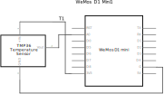
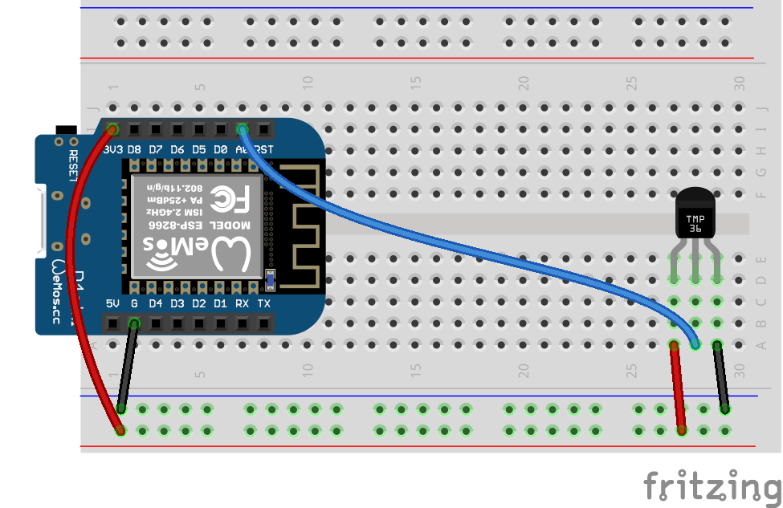

# ESP8266 and TMP36 Temperature Sensor

 

Code for getting started with TMP36 temperature sensor and an ESP8266 development board.

<br />

## Files and Folders

| File/Folder | Description |
|--- | --- |
| arduino | For Arduino, use the sketches in the Arduino Uno folder [../arduino-uno/arduino](../arduino-uno/arduino) |
| [micropython/](micropython/) | folder for micropython scripts. Pymakr is configured to sync this folder with the micropython device. |
| [micropython/read_temperature.py](micropython/read_temperature.py) | MicroPython script that reads the temperature value from the sensor and prints it to the REPL. |
| [esp8266-micropython-setup.ps1](esp8266-micropython-setup.ps1) | PowerShell script to install MicroPython on ESP8266 device and upload scripts. |
|  |  |

<br />

## Setup

Setup instructions for a WeMos D1 mini are below.

## Circuit Diagram

Wire the components as shown in the diagram.



#### Components Needed

* TMP36 temperature sensor
* connecting wires
* esp8266 device

<br />



<br />

### Default Pin Wiring

| Pin No | Function |  | Device Connection |
| --- | --- | --- | --- |
| 1 | +3.3V |  | Vdd |
| 6 | GND |  | GND |
| A0 | Analogue Input |  | Vout |
|  |  |  |  |


ESP8266s have a single analogue input, which can measure voltages in the range 0-1V at 10 bit depth. The WeMos D1 mini has a voltage divider on the A0 input which gives an effective voltage measurement range of 0V to ~3.2V.

Further details and other board pin out diagrams can be found here: https://randomnerdtutorials.com/esp8266-pinout-reference-gpios/

<br />

## Arduino

The sketch will work with many different types and chipset of board. To use an ESP8266 board with Arduino IDE, you will need to install the relevant board configuration files. Follow the instructions here: https://arduino-esp8266.readthedocs.io/en/latest/installing.html

The arduino sketch does not require any external libraries.

<br />

## MicroPython

No additional libraries are needed for micropython.

### Uploading Files

Test files can be uploaded using [ampy](https://learn.adafruit.com/micropython-basics-load-files-and-run-code/install-ampy).

```pwsh
PS> ampy --port <COM port of device> --baud 115200 put micropython/read_temperature.py
```

A PowerShell script ([esp8266-micropython-setup.ps1](esp8266-micropython-setup.ps1)) is also included to automatically setup MicroPython on an ESP8266 device.

```pwsh
PS> .\esp8266-micropython-setup.ps1
```

<br />

## References

- https://randomnerdtutorials.com/esp8266-pinout-reference-gpios/
